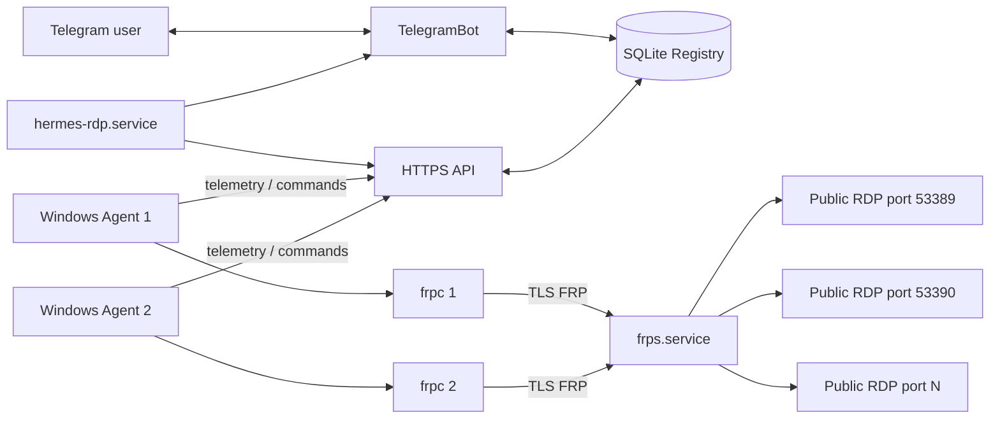
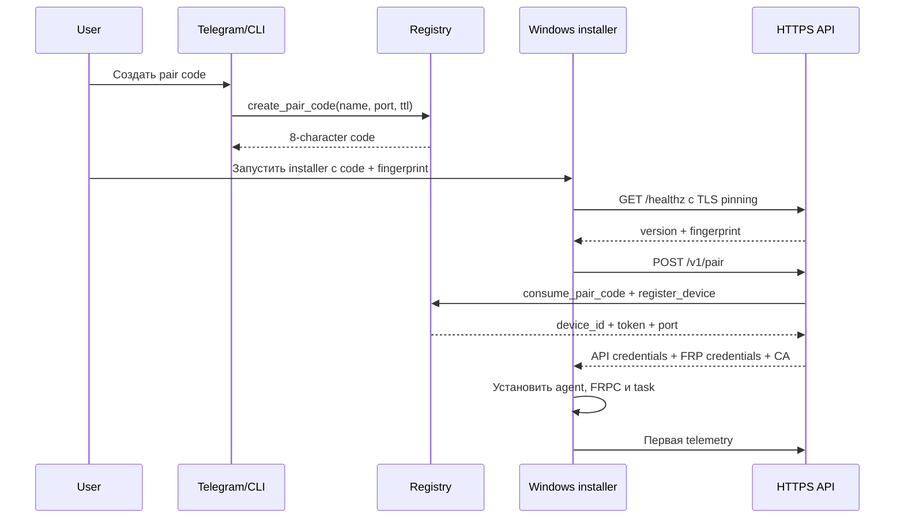
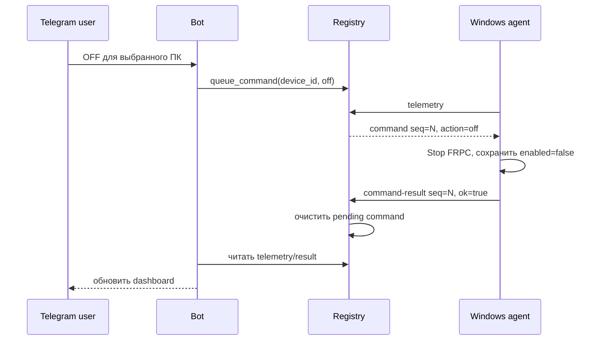

# Архитектура Hermes RDP

## Цели

Hermes RDP решает четыре задачи:

1. публикует RDP нескольких Windows-компьютеров через один публичный Linux-сервер;
2. сохраняет каждому ПК постоянный внешний порт;
3. даёт единое управление и мониторинг через Telegram;
4. не вводит особую логику для «основного» Windows-компьютера.

## Границы системы

### Специальный узел: Hermes server

Только сервер имеет инфраструктурную роль:

- принимает все FRP-туннели;
- выдаёт уникальные порты;
- хранит реестр и команды;
- обслуживает HTTPS API;
- взаимодействует с Telegram API;
- определяет ONLINE/OFFLINE по времени последней телеметрии.

### Равноправные узлы: Windows clients

Каждый Windows ПК:

- запускает один `HermesRdpAgent.ps1`;
- запускает собственный `frpc.exe`;
- публикует локальный `127.0.0.1:3389` на свой remote port;
- имеет отдельный `device_id` и API token;
- получает команды только для себя;
- не знает о других устройствах.

## Компоненты



## Серверные процессы

### `frps.service`

- binary: `/usr/local/bin/frps`;
- config: `/etc/frp/frps.toml`;
- user: `frp`;
- control port: `7000/tcp` по умолчанию;
- разрешённые remote ports: `53389–53420` по умолчанию;
- auth: общий FRP token;
- transport: принудительный TLS с собственной CA.

`frps` работает постоянно. Выключение отдельного ПК не должно останавливать сервис.

### `hermes-rdp.service`

Один Python-процесс запускает два daemon thread:

- `ThreadingHTTPServer` для API;
- long-polling Telegram bot.

Общая точка хранения — `Registry`, работающий с SQLite.

### `hermes-rdpctl`

CLI использует те же `Config` и `Registry`, что и сервис. Он предназначен для pairing, списка устройств, переименования, отзыва, сброса dashboard и диагностики.

## Windows-процессы

### `HermesRdpAgent.ps1`

Цикл каждые 3 секунды:

1. читает локальное состояние;
2. убеждается, что FRPC соответствует состоянию ON/OFF;
3. собирает Windows telemetry;
4. отправляет `POST /v1/devices/{id}/telemetry`;
5. получает pending command;
6. применяет `on`, `off` или `restart`;
7. отправляет результат через `command-result`;
8. ждёт остаток трёхсекундного интервала.

### `frpc.exe`

У каждого устройства отдельный proxy:

```toml
[[proxies]]
name = "rdp-<device_id>"
type = "tcp"
localIP = "127.0.0.1"
localPort = 3389
remotePort = <allocated_port>
```

### Scheduled Task

- name: `Hermes RDP Agent`;
- principal: `SYSTEM`;
- trigger: startup с задержкой 20 секунд;
- restart policy: до 999 попыток с интервалом 1 минута;
- execution limit: отсутствует.

## Жизненный цикл регистрации



Pair code хранится на сервере только в виде SHA-256, используется один раз и имеет срок действия.

## Жизненный цикл команды



Команда доставляется через ответ на следующий telemetry POST. Поэтому отдельный входящий канал команд на Windows не нужен.

## Модель данных SQLite

### `devices`

Хранит:

- идентичность устройства;
- display name и machine name;
- SHA-256 API token;
- RDP-port;
- enabled/revoked;
- telemetry и last seen;
- command sequence, pending command и последний result.

### `pair_codes`

Хранит hash кода, желаемое имя/порт, expiration и used timestamp.

### `settings`

Хранит состояние Telegram dashboard:

- `dashboard_message_id`;
- `screen`;
- `selected_device`;
- `live`;
- текущий `pair_code`.

SQLite работает в WAL mode.

## ONLINE/OFFLINE

По умолчанию устройство считается ONLINE, если последняя телеметрия была не старше 15 секунд. Интервал клиента — 3 секунды. Это даёт запас на кратковременную сетевую задержку.

## Потоки доверия

```text
Telegram user ID
    ↓
Telegram bot authorization
    ↓
Registry command for device_id
    ↓
Device-authenticated HTTPS polling
    ↓
Local FRPC process
```

Pairing отдельно защищён:

```text
One-time code + pinned API fingerprint
    ↓
Unique API token + FRP CA + assigned port
```

## Отказоустойчивость

- перезапуск Telegram/API не останавливает уже поднятые FRP-туннели;
- перезапуск FRPS временно закрывает все endpoints, но клиенты переподключаются;
- потеря Telegram не мешает текущим RDP-туннелям;
- потеря API не останавливает уже работающий FRPC, но блокирует telemetry и новые команды;
- Windows Scheduled Task перезапускает агент после сбоя.

## Известное архитектурное ограничение v1

API token уникален, но FRP token общий. Отзыв устройства блокирует API и dashboard, однако скомпрометированный `frpc.toml` содержит общий FRP token. Полный отзыв требует ротации FRP token и обновления доверенных клиентов.

## Куда добавлять новую функциональность

- HTTP contract: `server/hermes_rdp/api.py`;
- persistence/commands: `server/hermes_rdp/db.py`;
- Telegram UX: `server/hermes_rdp/bot.py`;
- server lifecycle: `server/hermes_rdp/service.py`;
- Windows behavior/telemetry: `client/HermesRdpAgent.ps1`;
- installation/migration: `scripts/`;
- systemd hardening: `server/systemd/`.

Перед изменением контракта API обновляй [API.md](API.md), тесты и release notes.
